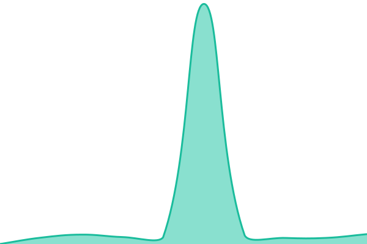
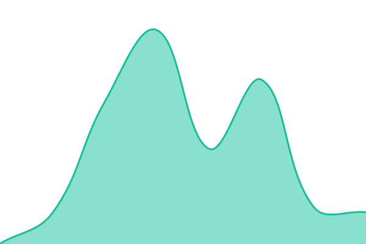
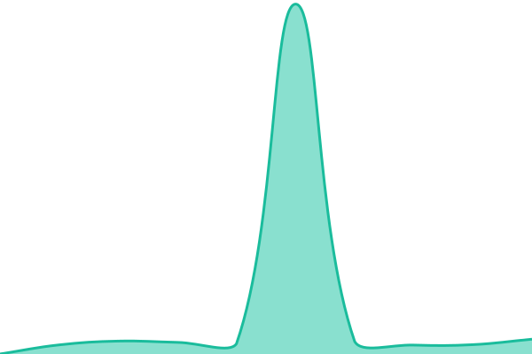

# [📈 Live Status](https://status.cypwn.xyz): <!--live status--> **🟩 All systems operational**

This repository contains the open-source uptime monitor and status page for [CyPwn](https://repo.cypwn.xyz), powered by [Upptime](https://github.com/upptime/upptime).

With [Upptime](https://upptime.js.org), you can get your own unlimited and free uptime monitor and status page, powered entirely by a GitHub repository. We use [Issues](https://github.com/cypwn/cypwn/issues) as incident reports, [Actions](https://github.com/cypwn/cypwn/actions) as uptime monitors, and [Pages](https://status.cypwn.xyz) for the status page.

<!--start: status pages-->
<!-- This summary is generated by Upptime (https://github.com/upptime/upptime) -->
<!-- Do not edit this manually, your changes will be overwritten -->
<!-- prettier-ignore -->
| URL | Status | History | Response Time | Uptime |
| --- | ------ | ------- | ------------- | ------ |
|  [CyPwn.xyz](https://cypwn.xyz) | 🟩 Up | [cy-pwn-xyz.yml](https://github.com/CyPwn/CyPwnStatus/commits/HEAD/history/cy-pwn-xyz.yml) | 

 732ms
     
 | 

<a href="https://status.cypwn.xyz/history/cy-pwn-xyz">100.00%</a>
    

|  [Repo](https://repo.cypwn.xyz) | 🟩 Up | [repo.yml](https://github.com/CyPwn/CyPwnStatus/commits/HEAD/history/repo.yml) | 

 268ms
     
 | 

<a href="https://status.cypwn.xyz/history/repo">100.00%</a>
    

|  [IPA Library](https://ipa.cypwn.xyz) | 🟩 Up | [ipa-library.yml](https://github.com/CyPwn/CyPwnStatus/commits/HEAD/history/ipa-library.yml) | 

 310ms
     
 | 

<a href="https://status.cypwn.xyz/history/ipa-library">100.00%</a>
    

|  [DRM](https://drm.cypwn.xyz) | 🟩 Up | [drm.yml](https://github.com/CyPwn/CyPwnStatus/commits/HEAD/history/drm.yml) | 

 222ms
     
 | 

<a href="https://status.cypwn.xyz/history/drm">100.00%</a>
    

|  [API](https://api.cypwn.xyz) | 🟩 Up | [api.yml](https://github.com/CyPwn/CyPwnStatus/commits/HEAD/history/api.yml) | 

 687ms
     
 | 

<a href="https://status.cypwn.xyz/history/api">100.00%</a>
    

<!--end: status pages-->

[**Visit our status website →**](https://status.cypwn.xyz)

## 📄 License

- Powered by: [Upptime](https://github.com/upptime/upptime)
- Code: [MIT](./LICENSE) © [CyPwn](https://repo.cypwn.xyz)
- Data in the `./history` directory: [Open Database License](https://opendatacommons.org/licenses/odbl/1-0/)
